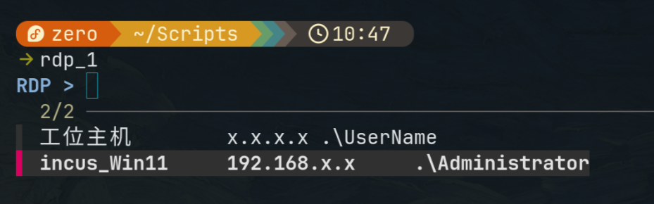
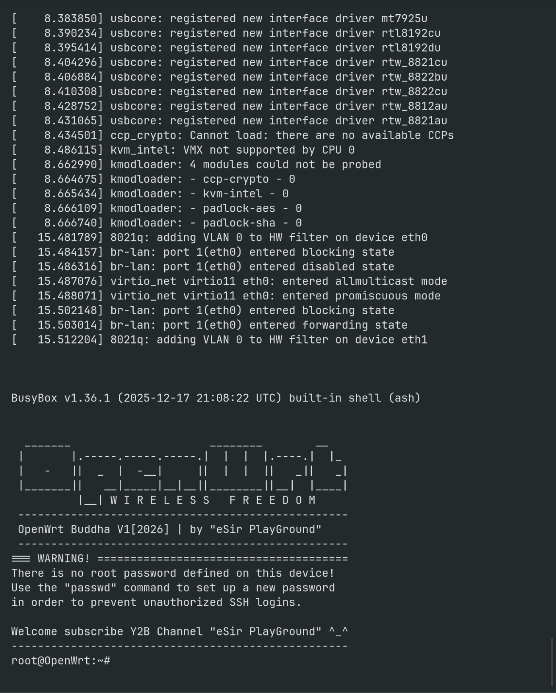
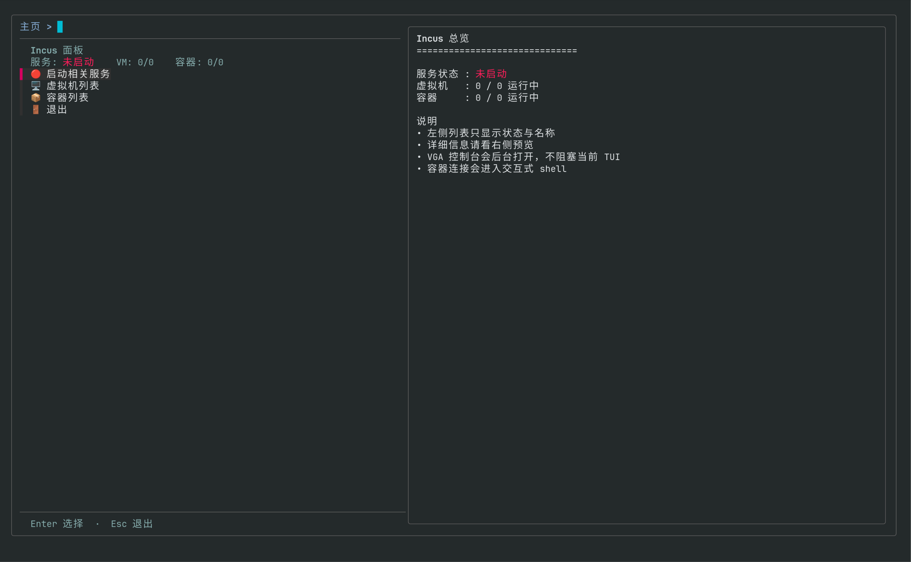
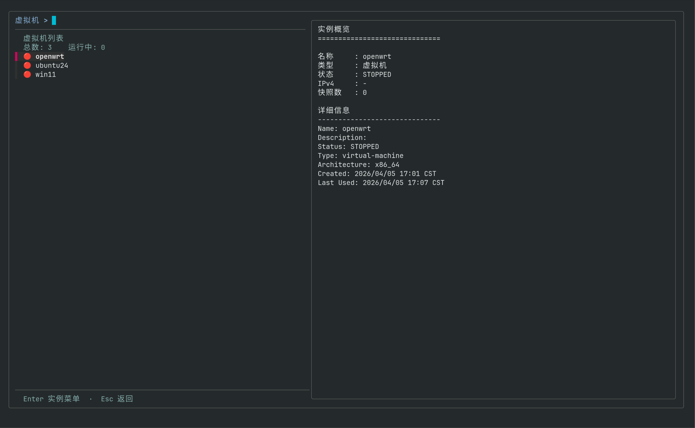
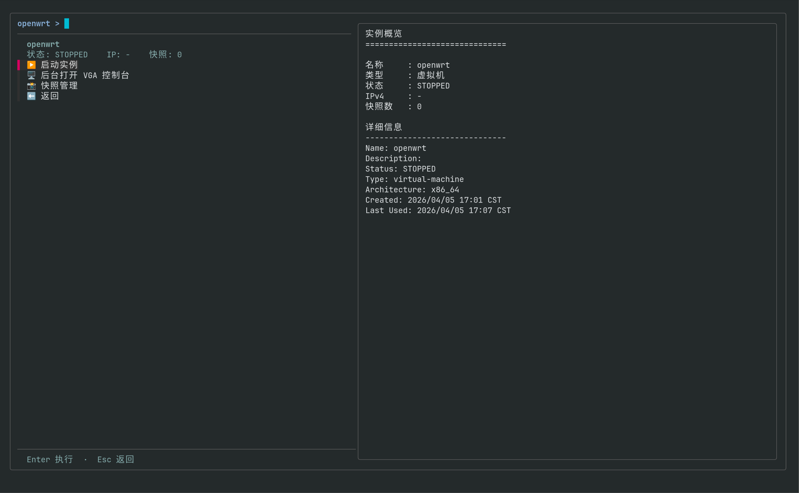
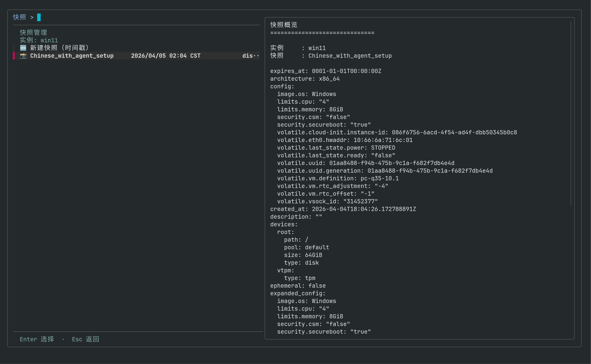

上一期我们完成了incus部署，本期主要解决Windows虚拟机的访问问题以及incus场景下的软路由配置，以实现更灵活的网络访问。最后提供一个本人Vibe Coding出的incus TUI管理脚本，方便日常使用。

## incus Windows VM相关

### 更合理的部署方式

[上期](https://blog.lentikr.top/posts/260404_fedora_setup/)我们提到，在incus中配置Windows虚拟机时需要注入VirtIO驱动，并使用手动加载的方法成功进行了注入。后来我又尝试了使用Distrobuilder重新封装Windows的iso镜像这种方法，这里一并介绍。这种方法需要先在本机安装Distrobuilder，我这里采用的是从源码构建的方法（官方未提供Fedora环境下的预编译包）。

```bash
wget https://linuxcontainers.org/downloads/distrobuilder/distrobuilder-3.3.1.tar.gz
tar -zxvf distrobuilder-3.3.1.tar.gz
cd distrobuilder-3.3.1/
make
sudo dnf install perl-hivex genisoimage swtpm
# genisoimage是distrobuilder最后会调用的iso生成工具，swtpm是Win11虚拟机中设置tpm模块需要的
```

进行镜像封装与系统初始化

```bash
sudo /home/zero/go/bin/distrobuilder repack-windows --windows-arch=amd64 --windows-version=w11 /var/lib/incus/iso/win11.iso ~/win11-incus.iso --drivers=/usr/share/virtio-win/virtio-win.iso
sudo mv ~/win11-incus.iso /var/lib/incus/iso/
sudo chmod 644 /var/lib/incus/iso/win11-incus.iso
sudo chcon -t svirt_home_t /var/lib/incus/iso/win11-incus.iso

incus init win11 --empty --vm
incus config set win11 image.os Windows
incus config set win11 limits.cpu 4
incus config set win11 limits.memory 8GiB
incus config device override win11 root size=64GiB
incus config set win11 security.csm false
incus config set win11 security.secureboot true
incus config device add win11 vtpm tpm
incus config device add win11 install-media disk source=/var/lib/incus/iso/win11-incus.iso boot.priority=10
```

随后进入VM进行系统安装即可直接识别磁盘。

### incus-agent编译安装

`incus-agent`是运行在**Incus 虚拟机 (VM)** 内部的一个守护进程。它的主要作用是作为宿主机Incus服务与虚拟机内部系统之间的“桥梁”，实现原本只有容器（Container）才能轻松完成的高级交互功能。

- 直接执行命令
- 文件传输
- 状态监控与指标
- 生命周期管理（更优雅的关机/重启，命令没变，但是变成了`incus-agent`向VM发送相关指令）

dnf可以直接安装`incus-agent`，但这通常只包含与宿主机系统架构一致的版本，比如本机就只有x86_64环境下Linux平台的`incus-agent`。如果要支持多平台的虚拟机，比如Linux+Windows，需要自己编译好对应平台的`incus-agent`，并为incus设置好环境变量`INCUS_AGENT_PATH`

```bash
sudo systemctl edit incus

# 写入下面内容
[Service]
Environment=INCUS_AGENT_PATH=/opt/incus/agent

# 重载incus服务并检查是否修改成功
sudo systemctl daemon-reload
sudo systemctl restart incus
systemctl cat incus
systemctl show incus -p Environment
```

下面我们就需要手动编译Windows平台的`incus-agent`并置于`INCUS_AGENT_PATH`中，下面是我的操作过程

```bash
git clone https://github.com/lxc/incus ~/src/incus
cd ~/src/incus/
# 最好与从Fedora仓库安装的incus版本一致
git tag | grep 6.19
incus version
git checkout v6.19.1

sudo mkdir -p /opt/incus/agent
sudo CGO_LDFLAGS_ALLOW="-Wl,-z,now" CGO_ENABLED=0 GOOS=windows GOARCH=amd64 go build -trimpath -tags=agent,netgo -o /opt/incus/agent/incus-agent.windows.x86_64 ./cmd/incus-agent/
```

这里需要注意的是，如果设置了`INCUS_AGENT_PATH`，需要把本系统通过包管理器安装的`incut_agent`文件也放过来（可以使用符号链接的方式），并遵从命名规则（如`incus-agent.linux.x86_64`）。随后对于Windows，需要手动加载Agent驱动。

```bash
incus config device add win11 agent disk source=agent:config
```

在Win中进入对应CD以管理员权限执行`install.ps1`脚本即可。这里的安装脚本我运行后会在中途退出，并且查看系统服务，发现Incus Agent这个服务无法启动，最后是通过将编译出的`incus-agent.exe`这个文件粘贴进`C:\Program Files/incus-agent`这个目录下再启动服务成功的。

### RDP访问

对于incus环境中的Windows虚拟机，使用RDP的方式访问体验是最好的，下面是rdp访问的相关设置。

1. 在Windows的设置中开启远程访问功能并为当前用户添加相关权限。
2. 在宿主机（Fedora）中安装xfreerdp（wayland下最佳的RDP解决方案）
3. 使用xfreerdp进行RDP访问

```bash
xfreerdp \
/v:"$HOST" \
/u:"$USER" \
/p:"$PASSWORD" \
/gfx +dynamic-resolution /cert:ignore /network:auto /scale:180
```

这里其实不建议以明文的方式传入密码，会在系统日志、`.bash_history`中以明文形式存储（当然个人电脑其实也无所谓）。如果想要更高的安全性，可以使用`secret-tool`，这是一个用于安全存储和管理敏感信息的命令行工具，可以避免敏感信息的硬编码。`secret-tool`本身不存储数据，它通过`D-Bus`与后端服务进行通信。常见的后端有`GNOME Keyring`、`KeePassXC`、`KWallet`等。由于我本人使用`KeePassXC`进行密码管理，所以就沿用`KeePassXC`的方案了。

在`KeePassXC`中的软件设置中启用保密服务集成后，在数据库自身的设置->保密服务集成中设定一个保存secret的群组。随后即可使用命令行添加、查询与删除敏感信息（也可以直接在`KeePassXC`的GUI界面直接操作），基本语法如下：

```bash
# 添加敏感信息
secret-tool store --label="我的标签" 属性名1 属性值1 属性名2 属性值2 ...
## 示例
secret-tool store --label="GitHub API Key" service github user alice

# 查询敏感信息
## lookup是精确匹配，属性对必须写全
secret-tool lookup service github user alice
## search可以匹配部分属性，会打印出该条目的标签、敏感信息值及所有属性
secret-tool search service github

# 删除敏感信息（精确匹配/部分匹配均可）
secret-tool clear service github user alice
secret-tool clear service github
```

借助`secret-tool`，我Vibe
Coding了以下脚本实现便捷的RDP登陆，实现的效果是列出脚本中储存的RDP主机显示名，回车后直接连接进入RDP桌面，其`HOST`、`USER`、`PASSWORD`均由脚本自动获取。

```bash
#!/usr/bin/env bash
set -euo pipefail

command -v fzf >/dev/null 2>&1 || {
	echo "缺少 fzf"
	exit 1
}

# 格式：显示名|HOST|USER
# USER 直接写最终传给 xfreerdp /u: 的内容
# 本地账号示例：.\admin
# 微软账号示例：name@outlook.com
ENTRIES=(
	"工位主机|x.x.x.x|.\admin"
	"incus_Win11|192.168.x.x|.\Administrator"
)

selected="$(
	printf '%s\n' "${ENTRIES[@]}" |
		awk -F'|' '{printf "%s\t%s\t%s\n", $1, $2, $3}' |
		fzf --delimiter=$'\t' --with-nth=1,2,3 \
			--prompt='RDP > ' \
			--height=40% \
			--reverse
)" || exit 0

IFS=$'\t' read -r NAME HOST USER <<<"$selected"

PW="$(secret-tool lookup service rdp server "$HOST" 2>/dev/null || true)"

[[ -n "$PW" ]] || {
	echo "没找到密码：$HOST / $USER"
	exit 1
}

nohup xfreerdp \
	/v:"$HOST" \
	/u:"$USER" \
	/p:"$PW" \
	/gfx +dynamic-resolution /scale:180 /f /cert:ignore /network:auto \
	/log-level:OFF \
	</dev/null >/dev/null 2>&1 &

disown 2>/dev/null || true
```



## incus openwrt软路由部署

部署openwrt的思路其实很简单，就是配置两个网卡，一个网卡使用NAT接通主机网络，另一个网卡为非NAT，并将需要由Openwrt路由的VM置于其中。

首先我们需要创建一个仅内网虚拟机用的子网，即Openwrt的LAN口所在的网络，用于给其他VM提供网络。

```bash
incus network create lablan \
  ipv4.address=192.168.50.254/24 \ # 这里可以填成想要的其他网段
  ipv4.dhcp=false \
  ipv4.nat=false \
  ipv6.address=none \
  dns.mode=none
```

安装Openwrt系统，这里直接使用[eSir大佬集成好基本插件的固件](https://drive.google.com/drive/folders/1UVrM6OnhEwBla18W0yNnX3iTnmyr-YeR)。

```bash
cd ~/Downloads
# 解压为img
gzip -dk 'openwrt-stable-24.10.5-buddha-version-v1[2026]-x86-64-generic-squashfs-uefi.img.gz'
ls -lh *.img
```

从硬盘镜像导入incus VM，需要使用`incus-tools`

```bash
sudo dnf install incus-tools

sudo incus-migrate
The local Incus server is the target [default=yes]:

What would you like to create?
1) Container
2) Virtual Machine
3) Virtual Machine (from .ova)
4) Custom Volume

Please enter the number of your choice: 2
Name of the new instance: openwrt
Please provide the path to a disk, partition, or qcow2/raw/vmdk image file: /home/zero/Downloads/openwrt-stable-24.10.5-buddha-version-v1[2026]-x86-64-generic-squashfs-uefi.img
Does the VM support UEFI booting? [default=yes]:
Does the VM support UEFI Secure Boot? [default=yes]: no

Instance to be created:
  Name: openwrt
  Project: default
  Type: virtual-machine
  Source: /home/zero/Downloads/openwrt-stable-24.10.5-buddha-version-v1[2026]-x86-64-generic-squashfs-uefi.img
  Source format: raw
  Config:
    security.secureboot: "false"

Additional overrides can be applied at this stage:
1) Begin the migration with the above configuration
2) Override profile list
3) Set additional configuration options
4) Change instance storage pool or volume size
5) Change instance network
6) Add additional disk
7) Change additional disk storage pool

Please pick one of the options above [default=1]: 1
Instance openwrt successfully created
```

为Openwrt添加LAN口网卡（WAN口的NAT是默认配置，不需要手动添加）：

```bash
incus config device add openwrt lan nic network=lablan   hwaddr=00:16:3e:50:00:02
```

进入Openwrt进行网络配置：

```bash
incus start openwrt --console
# 这里可能最后需要手动按一下Enter才能进入shell
```



```bash
vim /etc/config/network

# /etc/config/network
config interface 'loopback'
        option device 'lo'
        option proto 'static'
        option ipaddr '127.0.0.1'
        option netmask '255.0.0.0'

config globals 'globals'
        option ula_prefix 'fda8:dbe1:e3c9::/48'
        option packet_steering '1'

config device
        option name 'br-lan'
        option type 'bridge'
        list ports 'eth1' # 这里填ip list里那张LAN口对应的网卡，默认的eth0应该是NAT卡，所以这里通常应该需要是eth1

config interface 'lan'
        option device 'br-lan'
        option proto 'static'
        option ipaddr '192.168.50.2' # 这里改成你LAN口所在网络的网段内，填2是怕与宿主机冲突
        option netmask '255.255.255.0'
        option ip6assign '60'

config interface 'wan'
        option device 'eth0' # 这里注意是eth0了
        option proto 'dhcp'

config interface 'wan6'
        option device 'eth0' # eth0
        option proto 'dhcpv6'


# 修改完后执行
/etc/init.d/network restart
```

之后打开设置的LAN地址即可访问到Openwrt的配置站点（这里是192.168.50.2）。

随后的问题就是如何将新建的/已有的VM设置为使用Openwrt做路由。首先我们先创建一个使用Openwrt路由的incus Profile，此后新建的VM只要使用这个Profile就会自动接入这个网络了，同理，已有的VM也可以通过使用该Profile接入Openwrt软路由。

```bash
incus profile create openwrt-lan
incus profile device add openwrt-lan eth0 nic network\=lablan name\=eth0
incus profile show openwrt-lan
```

将已有的VM的Profile覆盖为openwrt-lan（在incus中，Profile中的设置按层级关系确定，即高层覆盖低层，低层已定义但高层未修改的部分沿用）

```bash
# 先关闭相关的虚拟机
incus stop ubuntu24
# 指定Profile（覆盖)
incus profile assign ubuntu24 default,openwrt-lan
incus start ubuntu24
```

启动新虚拟机时指定Profile（incus中允许指定多个profile，后面的profile优先级更高）

```bash
incus launch images:ubuntu/24.04 ubuntu2 --profile default --profile openwrt-lan
```

## incus VM/Container管理脚本

为了方便incus的使用，Vibe
Coding了一个TUI管理脚本，实现的功能有incus后台服务的启停、VM/Container管理，主要涉及状态管理、信息查询、快照的简单管理等。









```bash
#!/usr/bin/env bash
set -euo pipefail

SCRIPT_SELF="$(cd -- "$(dirname -- "${BASH_SOURCE[0]}")" && pwd)/$(basename -- "${BASH_SOURCE[0]}")"

need() {
	command -v "$1" >/dev/null 2>&1 || {
		printf '缺少命令: %s\n' "$1" >&2
		exit 1
	}
}

for cmd in incus fzf systemctl awk sed grep date; do
	need "$cmd"
done

RED=$'\033[31m'
GREEN=$'\033[32m'
YELLOW=$'\033[33m'
BOLD=$'\033[1m'
RESET=$'\033[0m'

SERVICE_SOCKET="incus.socket"
SERVICE_UNIT="incus.service"

fzf_has_footer=0
if fzf --help 2>&1 | grep -q -- '--footer'; then
	fzf_has_footer=1
fi

fzf_base=(
	--ansi
	--layout=reverse
	--height=100%
	--border
	--cycle
	--no-info
	--tabstop=8
)

service_running() {
	systemctl is-active --quiet "$SERVICE_SOCKET" &&
		systemctl is-active --quiet "$SERVICE_UNIT"
}

service_emoji() {
	if service_running; then
		printf '🟢'
	else
		printf '🔴'
	fi
}

service_action_text() {
	if service_running; then
		printf '停止相关服务'
	else
		printf '启动相关服务'
	fi
}

instance_state_emoji() {
	case "$1" in
	RUNNING) printf '🟢' ;;
	STOPPED | STOPPING) printf '🔴' ;;
	*) printf '🟡' ;;
	esac
}

sanitize_csv_field() {
	local v="${1:-}"
	v="${v#\"}"
	v="${v%\"}"
	printf '%s' "$v"
}

pause_msg() {
	printf '\n%b%s%b\n' "$BOLD" "$1" "$RESET" >&2
	printf '按回车继续...' >&2
	read -r _
}

confirm() {
	local prompt="${1:-确认？}"
	local ans
	local opts=("${fzf_base[@]}" --height=10 --prompt="$prompt > " --header='Enter 确认 / Esc 取消')
	((fzf_has_footer)) && opts+=(--footer='Enter 确认  ·  Esc 取消')

	if ! ans="$(
		printf '%s\n' "否" "是" |
			fzf "${opts[@]}"
	)"; then
		return 1
	fi

	[[ "$ans" == "是" ]]
}

count_kind() {
	local kind="$1"
	local rows total=0 running=0 state

	if ! service_running; then
		printf '0\t0\n'
		return 0
	fi

	rows="$(incus list "type=$kind" -c s -f csv,noheader 2>/dev/null || true)"

	while IFS= read -r state; do
		[[ -z "${state:-}" ]] && continue
		state="$(sanitize_csv_field "$state")"
		((total += 1))
		[[ "$state" == "RUNNING" ]] && ((running += 1))
	done <<<"$rows"

	printf '%s\t%s\n' "$total" "$running"
}

kind_cn() {
	case "$1" in
	virtual-machine) printf '虚拟机' ;;
	container) printf '容器' ;;
	*) printf '%s' "$1" ;;
	esac
}

main_statusline() {
	local vm_total vm_running ct_total ct_running service_text

	IFS=$'\t' read -r vm_total vm_running < <(count_kind "virtual-machine")
	IFS=$'\t' read -r ct_total ct_running < <(count_kind "container")

	if service_running; then
		service_text="$(printf '%b运行中%b' "$GREEN" "$RESET")"
	else
		service_text="$(printf '%b未启动%b' "$RED" "$RESET")"
	fi

	printf '服务: %s    VM: %s/%s    容器: %s/%s' \
		"$service_text" "$vm_running" "$vm_total" "$ct_running" "$ct_total"
}

render_main_row() {
	local key="$1"
	local icon="$2"
	local label="$3"
	printf '%s\t%s %s\n' "$key" "$icon" "$label"
}

render_action_row() {
	local key="$1"
	local icon="$2"
	local label="$3"
	printf '%s\t%s %s\n' "$key" "$icon" "$label"
}

instance_record() {
	local kind="$1"
	local name="$2"
	local out

	out="$(incus list "type=$kind" -c ns4S -f csv,noheader 2>/dev/null || true)"
	awk -F',' -v n="$name" '$1 == n { print; exit }' <<<"$out"
}

instance_meta() {
	local kind="$1"
	local name="$2"
	local row state ip snaps

	row="$(instance_record "$kind" "$name")"

	if [[ -z "$row" ]]; then
		printf 'UNKNOWN\t-\t0\n'
		return 0
	fi

	IFS=',' read -r _name state ip snaps <<<"$row"

	state="$(sanitize_csv_field "${state:-}")"
	ip="$(sanitize_csv_field "${ip:-}")"
	snaps="$(sanitize_csv_field "${snaps:-}")"

	[[ -z "$ip" ]] && ip="-"
	[[ -z "$snaps" ]] && snaps="0"

	printf '%s\t%s\t%s\n' "$state" "$ip" "$snaps"
}

render_instance_row() {
	local name="$1"
	local state="$2"

	printf '%s\t%s %s\n' \
		"$name" \
		"$(instance_state_emoji "$state")" \
		"$name"
}

build_instance_rows() {
	local kind="$1"
	local out name state

	if ! service_running; then
		printf '__SERVICE__\t🔴 Incus 服务未运行\n'
		return 0
	fi

	out="$(incus list "type=$kind" -c ns -f csv,noheader 2>/dev/null || true)"

	if [[ -z "${out//[$'\t\r\n ']/}" ]]; then
		printf '__EMPTY__\t📭 当前没有%s\n' "$(kind_cn "$kind")"
		return 0
	fi

	while IFS=',' read -r name state; do
		[[ -z "${name:-}" ]] && continue

		name="$(sanitize_csv_field "$name")"
		state="$(sanitize_csv_field "${state:-}")"

		render_instance_row "$name" "$state"
	done <<<"$out"
}

toggle_service() {
	if service_running; then
		confirm "停止 Incus 相关服务？" || return 0
		sudo systemctl stop "$SERVICE_SOCKET" "$SERVICE_UNIT"
	else
		confirm "启动 Incus 相关服务？" || return 0
		sudo systemctl start --now "$SERVICE_SOCKET" "$SERVICE_UNIT"
	fi
}

toggle_instance() {
	local kind="$1"
	local name="$2"
	local state ip snaps

	IFS=$'\t' read -r state ip snaps < <(instance_meta "$kind" "$name")

	if [[ "$state" == "RUNNING" ]]; then
		incus stop "$name"
	else
		incus start "$name"
	fi
}

launch_vm_vga() {
	local name="$1"

	if ! command -v remote-viewer >/dev/null 2>&1 && ! command -v spicy >/dev/null 2>&1; then
		pause_msg "未检测到 SPICE 客户端（remote-viewer 或 spicy），无法打开 VGA 控制台。"
		return 0
	fi

	if command -v setsid >/dev/null 2>&1; then
		setsid -f sh -c '
			exec incus console "$1" --type=vga >/dev/null 2>&1 </dev/null
		' sh "$name" || true
	else
		nohup sh -c '
			exec incus console "$1" --type=vga >/dev/null 2>&1 </dev/null
		' sh "$name" >/dev/null 2>&1 &
		disown 2>/dev/null || true
	fi
}

enter_container_shell() {
	local name="$1"

	clear
	incus exec "$name" -- sh -lc '
		if command -v bash >/dev/null 2>&1; then
			exec bash -l
		elif command -v ash >/dev/null 2>&1; then
			exec ash
		else
			exec sh
		fi
	'
}

snapshot_show_any() {
	local inst="$1"
	local snap="$2"
	incus snapshot show "$inst" "$snap" 2>/dev/null ||
		incus snapshot show "$inst/$snap" 2>/dev/null ||
		true
}

snapshot_delete_any() {
	local inst="$1"
	local snap="$2"
	incus snapshot delete "$inst" "$snap" 2>/dev/null ||
		incus snapshot delete "$inst/$snap" 2>/dev/null ||
		true
}

build_snapshot_rows() {
	local inst="$1"
	local out snap taken expires stateful mode

	printf '__CREATE__\t🆕 新建快照（时间戳）\n'

	out="$(incus snapshot list "$inst" -c nTEs -f csv,noheader 2>/dev/null || true)"

	while IFS=',' read -r snap taken expires stateful; do
		[[ -z "${snap:-}" ]] && continue

		snap="$(sanitize_csv_field "${snap:-}")"
		taken="$(sanitize_csv_field "${taken:-}")"
		expires="$(sanitize_csv_field "${expires:-}")"
		stateful="$(sanitize_csv_field "${stateful:-}")"

		[[ -z "$expires" ]] && expires="-"

		mode="disk-only"
		case "$stateful" in
		true | TRUE | yes | YES) mode="stateful" ;;
		esac

		printf '%s\t📸 %s\t%s\t%s\t%s\n' \
			"$snap" "$snap" "$taken" "$expires" "$mode"
	done <<<"$out"
}

preview_main() {
	local vm_total vm_running ct_total ct_running

	printf '%bIncus 总览%b\n' "$BOLD" "$RESET"
	printf '%s\n\n' '=============================='

	if service_running; then
		printf '服务状态 : %b运行中%b\n' "$GREEN" "$RESET"
	else
		printf '服务状态 : %b未启动%b\n' "$RED" "$RESET"
	fi

	IFS=$'\t' read -r vm_total vm_running < <(count_kind "virtual-machine")
	IFS=$'\t' read -r ct_total ct_running < <(count_kind "container")

	printf '虚拟机   : %s / %s 运行中\n' "$vm_running" "$vm_total"
	printf '容器     : %s / %s 运行中\n' "$ct_running" "$ct_total"

	printf '\n%b说明%b\n' "$BOLD" "$RESET"
	printf '• 左侧列表只显示状态与名称\n'
	printf '• 详细信息请看右侧预览\n'
	printf '• VGA 控制台会后台打开，不阻塞当前 TUI\n'
	printf '• 容器连接会进入交互式 shell\n'
}

preview_instance() {
	local kind="$1"
	local name="$2"
	local state ip snaps

	if [[ "$name" == "__EMPTY__" ]]; then
		printf '%b%s%b\n' "$BOLD" "列表为空" "$RESET"
		printf '%s\n\n' '=============================='
		printf '当前没有%s。\n' "$(kind_cn "$kind")"
		printf '你仍然可以按 Esc 返回上一级。\n'
		return 0
	fi

	if [[ "$name" == "__SERVICE__" ]]; then
		printf '%b%s%b\n' "$BOLD" "服务未运行" "$RESET"
		printf '%s\n\n' '=============================='
		printf 'Incus 服务当前未启动。\n'
		printf '请先回到主页启动相关服务。\n'
		return 0
	fi

	IFS=$'\t' read -r state ip snaps < <(instance_meta "$kind" "$name")

	printf '%b实例概览%b\n' "$BOLD" "$RESET"
	printf '%s\n\n' '=============================='
	printf '名称     : %s\n' "$name"
	printf '类型     : %s\n' "$(kind_cn "$kind")"
	printf '状态     : %s\n' "$state"
	printf 'IPv4     : %s\n' "$ip"
	printf '快照数   : %s\n' "$snaps"

	printf '\n%b详细信息%b\n' "$BOLD" "$RESET"
	printf '%s\n' '------------------------------'
	incus info "$name" 2>/dev/null | sed -n '1,40p' || true
}

preview_snapshot() {
	local inst="$1"
	local snap="$2"

	printf '%b快照概览%b\n' "$BOLD" "$RESET"
	printf '%s\n\n' '=============================='
	printf '实例     : %s\n' "$inst"
	printf '快照     : %s\n\n' "$snap"
	snapshot_show_any "$inst" "$snap"
}

main_menu() {
	while true; do
		local header selected opts=()

		header="$(printf '%b%s%b\n%s' \
			"$BOLD" "Incus 面板" "$RESET" \
			"$(main_statusline)")"

		opts=(
			"${fzf_base[@]}"
			--delimiter=$'\t'
			--with-nth=2
			--prompt='主页 > '
			--header="$header"
			--preview="$SCRIPT_SELF __preview_main"
			--preview-window='right:56%:wrap:noinfo'
		)
		((fzf_has_footer)) && opts+=(--footer='Enter 选择  ·  Esc 退出')

		if ! selected="$(
			{
				render_main_row "svc" "$(service_emoji)" "$(service_action_text)"
				render_main_row "vms" "🖥️" "虚拟机列表"
				render_main_row "cts" "📦" "容器列表"
				render_main_row "ext" "🚪" "退出"
			} | fzf "${opts[@]}"
		)"; then
			break
		fi

		case "${selected%%$'\t'*}" in
		svc) toggle_service ;;
		vms) instance_list_menu "virtual-machine" ;;
		cts) instance_list_menu "container" ;;
		ext) break ;;
		esac
	done
}

instance_list_menu() {
	local kind="$1"
	local rows selected name header total running opts=()

	while true; do
		rows="$(build_instance_rows "$kind")"
		IFS=$'\t' read -r total running < <(count_kind "$kind")

		header="$(printf '%b%s列表%b\n总数: %s    运行中: %s' \
			"$BOLD" "$(kind_cn "$kind")" "$RESET" \
			"$total" "$running")"

		opts=(
			"${fzf_base[@]}"
			--delimiter=$'\t'
			--with-nth=2
			--prompt="$(kind_cn "$kind") > "
			--header="$header"
			--preview="\"$SCRIPT_SELF\" __preview_instance '$kind' {1}"
			--preview-window='right:56%:wrap:noinfo'
		)
		((fzf_has_footer)) && opts+=(--footer='Enter 实例菜单  ·  Esc 返回')

		if ! selected="$(
			printf '%s\n' "$rows" | fzf "${opts[@]}"
		)"; then
			return 0
		fi

		name="${selected%%$'\t'*}"

		case "$name" in
		__EMPTY__ | __SERVICE__)
			continue
			;;
		*)
			instance_menu "$kind" "$name"
			;;
		esac
	done
}

instance_menu() {
	local kind="$1"
	local name="$2"

	while true; do
		local state ip snaps header selected toggle_key connect_key opts=()

		IFS=$'\t' read -r state ip snaps < <(instance_meta "$kind" "$name")

		if [[ "$state" == "RUNNING" ]]; then
			toggle_key="stop"
		else
			toggle_key="start"
		fi

		if [[ "$kind" == "virtual-machine" ]]; then
			connect_key="vga"
		else
			connect_key="shell"
		fi

		header="$(printf '%b%s%b\n状态: %s    IP: %s    快照: %s' \
			"$BOLD" "$name" "$RESET" "$state" "$ip" "$snaps")"

		opts=(
			"${fzf_base[@]}"
			--delimiter=$'\t'
			--with-nth=2
			--prompt="${name} > "
			--header="$header"
			--preview="\"$SCRIPT_SELF\" __preview_instance '$kind' '$name'"
			--preview-window='right:56%:wrap:noinfo'
		)
		((fzf_has_footer)) && opts+=(--footer='Enter 执行  ·  Esc 返回')

		if ! selected="$(
			{
				if [[ "$toggle_key" == "stop" ]]; then
					render_action_row "stop" "⏹️" "停止实例"
				else
					render_action_row "start" "▶️" "启动实例"
				fi

				if [[ "$connect_key" == "vga" ]]; then
					render_action_row "vga" "🖥️" "后台打开 VGA 控制台"
				else
					render_action_row "shell" "⌨️" "进入容器 Shell"
				fi

				render_action_row "snap" "📸" "快照管理"
				render_action_row "back" "⬅️" "返回"
			} | fzf "${opts[@]}"
		)"; then
			return 0
		fi

		case "${selected%%$'\t'*}" in
		start | stop)
			toggle_instance "$kind" "$name"
			;;
		vga)
			launch_vm_vga "$name"
			;;
		shell)
			enter_container_shell "$name"
			;;
		snap)
			snapshot_menu "$name"
			;;
		back)
			return 0
			;;
		esac
	done
}

snapshot_menu() {
	local inst="$1"

	while true; do
		local rows selected snap header opts=()

		rows="$(build_snapshot_rows "$inst")"

		header="$(printf '%b快照管理%b\n实例: %s' \
			"$BOLD" "$RESET" "$inst")"

		opts=(
			"${fzf_base[@]}"
			--delimiter=$'\t'
			--with-nth=2,3,4,5
			--prompt="快照 > "
			--header="$header"
			--preview="if [ {1} = __CREATE__ ]; then printf '将使用时间戳创建新快照\n'; else \"$SCRIPT_SELF\" __preview_snapshot '$inst' {1}; fi"
			--preview-window='right:56%:wrap:noinfo'
		)
		((fzf_has_footer)) && opts+=(--footer='Enter 选择  ·  Esc 返回')

		if ! selected="$(
			printf '%s\n' "$rows" | fzf "${opts[@]}"
		)"; then
			return 0
		fi

		snap="${selected%%$'\t'*}"

		if [[ "$snap" == "__CREATE__" ]]; then
			incus snapshot create "$inst" "snap-$(date +%Y%m%d-%H%M%S)"
			continue
		fi

		snapshot_action_menu "$inst" "$snap"
	done
}

snapshot_action_menu() {
	local inst="$1"
	local snap="$2"

	while true; do
		local header selected opts=()

		header="$(printf '%b%s/%s%b\n选择快照操作' \
			"$BOLD" "$inst" "$snap" "$RESET")"

		opts=(
			"${fzf_base[@]}"
			--delimiter=$'\t'
			--with-nth=2
			--prompt="快照操作 > "
			--header="$header"
			--preview="\"$SCRIPT_SELF\" __preview_snapshot '$inst' '$snap'"
			--preview-window='right:56%:wrap:noinfo'
		)
		((fzf_has_footer)) && opts+=(--footer='Enter 执行  ·  Esc 返回')

		if ! selected="$(
			{
				render_action_row "restore" "⏪" "恢复快照"
				render_action_row "diskonly" "💽" "仅恢复磁盘"
				render_action_row "rename" "✏️" "重命名快照"
				render_action_row "delete" "🗑️" "删除快照"
				render_action_row "back" "⬅️" "返回"
			} | fzf "${opts[@]}"
		)"; then
			return 0
		fi

		case "${selected%%$'\t'*}" in
		restore)
			confirm "恢复 ${inst}/${snap}？" || continue
			incus snapshot restore "$inst" "$snap"
			;;
		diskonly)
			confirm "仅恢复 ${inst}/${snap} 的磁盘状态？" || continue
			incus snapshot restore "$inst" "$snap" --diskonly
			;;
		rename)
			printf '新快照名: '
			read -r newname
			[[ -n "${newname:-}" ]] || continue
			incus snapshot rename "$inst" "$snap" "$newname"
			snap="$newname"
			;;
		delete)
			confirm "删除 ${inst}/${snap}？" || continue
			snapshot_delete_any "$inst" "$snap"
			return 0
			;;
		back)
			return 0
			;;
		esac
	done
}

case "${1:-}" in
__preview_main)
	preview_main
	exit 0
	;;
__preview_instance)
	preview_instance "$2" "$3"
	exit 0
	;;
__preview_snapshot)
	preview_snapshot "$2" "$3"
	exit 0
	;;
esac

main_menu
```
